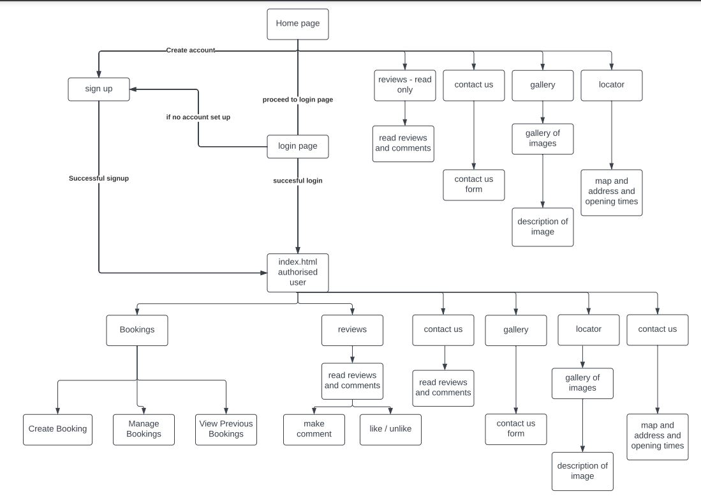
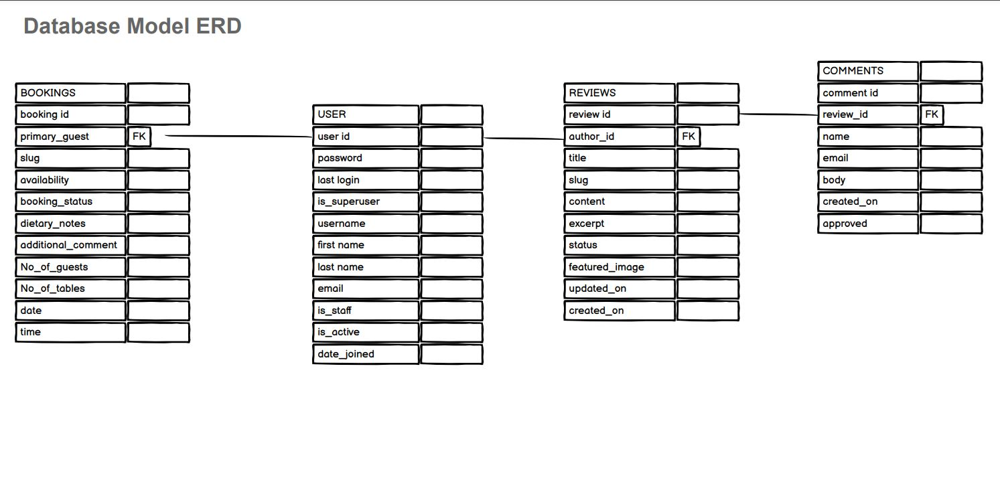

# FINE-WINE-N-DINE @ NANNY'S

FINE-WINE-N-DINE is a web application based on a local Public house "Nanny's" and restaurant with a state of the art sports bar, cocktail bar and accomodation to come in the near future.

The purpose of this web application is to showcase the restaurant Fine-wine-n-dine and allow users to create bookings for the restaurant, which can hold a maximum of 60 guests in one sitting, and to allow bookings of up to 60 guests per hour during the opening hours. 

Users can also create, read, comment and like reviews from past guests or leave a review voicing their opinions of the restaurant and public house. 

The benefit of this application will allow users to create and manage bookings online and their bookings will be catered for on their chosen date and time. Users can create accounts and update edit and delete their accounts should they feel the need to do so.

### Deployed at: https://b-stritch-p4-fine-wine-n-dine.herokuapp.com/

## Table of Contents
1. [**UX**](#ux)
    1. [**User Stories**](#user-stories)
        1. [**New Users**](#new-users)
        2. [**Existing Members**](#existing-members)
        3. [**Admin / Staff Users**](#admin-/-staff-users)
    2. [**Wireframes**](#wireframes)
    3. [**Entity Relationship Diagram (ERD)**](#entity-relationship-diagram-(ERD))
2. [**Features**](#features)
    1. [**Existing Features**](#existing-features)
        1. [**Regular Users**](#regular-users)
        2. [**Staff Users**](#staff-users)
    2. [**Future Features**](#future-features)
3. [**Technologies Used**](#technologies-used)
4. [**Testing**](#testing)
    1. [**User Credentials**](#user-credentials)
        1. [**Test User**](#test-user)
        2. [**Test User Staff**](#test-user-staff)
    2. [**Manual**](#manual)
    3. [**Validation**](#validation)
        1. [**CSS**](#CSS)
        2. [**HTML**](#HTML)
        3. [**JavaScript**](#javaScript)
        4. [**Codacy**](#codacy)
    4. [**Automated**](#automated)
        1. [**Travis**](#travis)
        2. [**Django / Coverage**](#django-/-coverage)
            1. [**Test Steps**](#test-steps)
    5. [**Responsiveness**](#responsiveness)
    6. [**Bugs Found**](#bugs-found)
5. [**Deployment**](#deployment)
    1. [**GitHub**](#GitHub)
        1. [**To commit the code on GitPod to GitHub**](#to-commit-the-code-on-GitPod-to-GitHub)
    2. [**Heroku**](#heroku)
6. [**Credits**](#credits)
    1. [**Content**](#content)
    2. [**Media**](#media)
    3. [**Acknowledgements**](#acknowledgements)

## UX
This project was designed to allow users to, through CRUD functionality, manage bookings for the restaurant, reviews from guests past present. In particular;
- Allows users to create an account through the signup form
- Allows users to edit their accounts details on their profile page
- Allows users to delete their accounts from their profile page

- Allows users to create a booking through the create booking form attached to the bookings page
- Allows users to edit their booking through the edit booking form attached to the bookings page
- Allows users to delete their booking through the delete booking link attached to the edit bookings page

- Allows users to create a review through the create review form attached to the reviews page
- Allows users to edit their review through the edit review form attached to the reviews page
- Allows users to delete their review through the delete review link attached to the edit reviews page

- Allows users to create a comment through the create comment form attached to the reviews page
- Allows users to edit their comment through the edit comment form attached to the reviews page
- Allows users to delete their comment through the edit comment link attached to the edit reviews page

This website is designed for the regular everyday individuals and is appropriate to all age groups as the restaurant aters for all age groups and with the additional sports bar attached which would be particularly aimed at sports fans as the venue has 12 large screens based in seperate areas in the establishment and offers a diverse selection of sporting events daily. The website allows guests to create reviews and tells others of their experiences. 

At nanny's, there are four types of vintage wines on draught along with all the regular slection of beers, however, nanny's has been fitted with a cocktail bar for the guests who like an exotic beverage which makes for some fantastic images for reviews.

I feel that this website satisfies the base requirements in that the users can create, read, update and delete data related to items in the database in an easy to use and visually appealing interface. 

There are a range of apps including Bookings, Reviews and Site pages that all work together seamlessly to provide a beautifully designed and easy to navigate website that has been designed to appeal to a wide range of users. 

A new user who does not have an account will only have access to the homepage (index.html), the about us page, the menu page, contact and about us page,a restricted version of the reviews page the signup page, and the login page. They will be unable to make bookings, leave reviews or comments on the existing reviews.  

Once logged in, the members will have access to the sites remaining functionality for creating reviews, commenting and liking reviews, creating bookings, viewing existing bookings, editing and deleting reviews,comments and editing content on their personal profile.

Once logged in, staff members have access to the same functionality as members for testing purposes.The staff status allows selected users to access the management area where staff can view all bookings , pending bookings, approved bookings, completed bookings and allows access to the django administration area where the staff member can view all bookings, reviews, comments, users etc and has administration priveledges which allows them to create edit and update reviews, comments, bookings, users etc. The administration area is required in order to publish comments which have been submitted for approval prior to the comment getting published.

### User Stories
#### New Users
- As a new user, I would like to be able to view information about the establishment so that I can decide whether to use their services or not
- As a new user, I would like to be able to see reasons why I should create an account so that I can decide if I would like to become a members
- As a new user, I would like to be able to view a menu to see what type of foods are on offer
- As a new user, I would like to be able to view reviews from past guests so that I can see what other users think of the establishment

#### Existing Members
- As an existing member, I would like to be able to log into my profile easily so that I avail of members only attributes of the website.
- As an existing member, I would like to be able to log into my profile easily so that I can review my profile information
- As an existing member, I would like to be able to edit my personal information on my profile so that I can keep the information up to date on the database
- As an existing member, I would like to be able to delete my profile should i wish to do so

- As an existing member, I would like to be able to view my bookings 
- As an existing member, I would like to be able to edit all of my bookings
- As an existing member, I would like to be able to delete my bookings

- As an existing member, I would like to be able to view all reviews 
- As an existing member, I would like to be able to edit all of my reviews
- As an existing member, I would like to be able to delete my reviews

- As an existing member, I would like to be able to view my comments on reviews 
- As an existing member, I would like to be able to edit all of my comments on reviews
- As an existing member, I would like to be able to delete my comments on reviews

#### Admin / Staff Users
- As a staff member, I would like to be able to view all the restaurant bookings 
- As a staff member, I would like to be able to view all the pending restaurant bookings 
- As a staff member, I would like to be able to view all the approved restaurant bookings 
- As a staff member, I would like to be able to view all the completed restaurant bookings 
- As a staff member, I would like to be able to manage all the restaurant bookings
- As a staff member, I would like for the application to stop any booking duplications
- As a staff member, I would like for the application to only allow a predefined number of guests per hour

- As a staff member, I would like to be able to view all the reviews
- As a staff member, I would like to be able to edit any of the reviews if required
- As a staff member, I would like to be able to delete a review in the event that it contains any offensive or inappropriate content
- As a staff member, I would like to be able to view all comments on reviews
- As a staff member, I would like to be able to approve or disprove all comments on reviews in the event that they contain any offensive or inappropriate content
- As a staff member, I would like to be able to edit any of the comments on a review if required 

- As a staff member, I would like to be able to view all of the users of the website so that I can manage them
- As a staff member, I would like to be able to edit a users Information should it be required
- As a staff member, I would like to be able to delete a user from the website if required
- As a staff member, I would like to be able to be able to edit a users information if required
- As a staff member, I would like to be able to be able to grant a user staff access or remove if required

### Wireframes
As there are many pages to this project, I have included the wireframes in a separate document.

Please see the wireframes.md file for the entire collection of wireframes: https://github.com/BrianStritch/Brian-Stritch-P4-Fine-Wine-n-Dine/blob/main/wireframes.md

### Site Map

### Entity Relationship Diagram (ERD)

## Features
### Existing Features
#### Regular Users 
1. Login - The customers are able to create their own accounts and log into the website with secure details.
2. Sign-Up - New users can sign up to create an account.
3. When creating a profile, it will not allow users to create a profile with the same username as another member
4. User Profile - Each user has their own profile that welcomes them by Username for personalisation.
5. Users can create bookings from the bookings page which is visible to logged in users.
6. Users can view their bookings from the bookings page which is visible to logged in users.
7. Users can select a booking and view , edit or delete the booking from the bookings detail page which is visible to logged in users.
8. Users can view reviews from past guests from the reviews page which is visible to all users.
9. Users can view specific reviews details and comments by clicking the review which redirects to the reviews detail page.
10. Users can edit or delete their own reviews or comments from the reviews detail page where an edit and delete button are visible to logged in users, but only for reviews or comments which were created by that user.
11. Users can view the menu to see what food products are available.
12. Users can view the contact and about us page to understand who the owners of the establishment are and what they are about. 
13. Users can also see the contact information, should they wish to contact the establisment directly.
14. Users can view the opnening hours to see when the establishment is open for business.
15. Users can see a gallery of images populated by images provided by guests from reviews.
16. Users can log out at any time from the site by clicking on the logout button 

#### Staff Users
1. Edit Bookings - Staff users can edit any bookings saved to the database using a simple form.
2. Edit Reviews - Staff users can edit any reviews saved to the database using a simple form.
3. Edit Comments- Staff users can edit any comments saved to the database using a simple form.
4. Delete Bookings - Staff users can delete any bookings saved to the database.
5. Delete Reviews - Staff users can delete any reviews saved to the database.
6. Delete Comments- Staff users can delete any comments saved to the database.
7. Edit Users - Staff users can edit any users saved to the database.
8. Delete Users - Staff users can delete any users saved to the database.

### Future Features
1. An Accomodation booking application will be added in a future update so the guests can stay in our new state of the art rooms.
2. A Menu app will be added in order for the staff / admin users to change the menu with a simple update form.
3. A payment method would be added in a future update so that the user can pre-pay their booking
4. A Merchandise shop will be added so that guests can purchase Nanny's clothing merchandise

## Technologies Used
- HTML - This site uses HTML to instruct the browser how to interprit the code correctly and arrange the layout.
- CSS - This site uses CSS to aid in the style, and overall theme of the website
- Bootstrap - This site uses Bootstrap elements to help design the framework of the site
- Django - This was the chosen framework for developing the project
- Python - This language was chosen to code the a large amount of the functionality of the site
- JavaScript - this was used to program some of the features on the site, such as the messages timeout
- Balsamiq - This was used to create the wireframes in the design phase
- Heroku - This was chosen to host the website app for deployment.
- Coverage - This reporting tool was installed and used to produce reports showing how much of the apps had been tested
- Cloudinary - Cloudinary storage was set up and used for storing website images
- Postgres - This Relational Datatabase was used to handle the data storage

## Testing
### User Credentials
There are two main uses on this site; a site member and a site staff member. Please use the logins below to access and review both user types:

#### Test User
- Username: testuser
- Password: administration

#### Admin User
- Username: admin
- Password: administration

### Manual
As there are many pages for the fine-wine-n-dine website which had to be manually tested to ensure functionality and UX were correct, they have been included in a separate file to avoid taking up too much space on the README.md documentation.

Please see the manual_testing.md file for the full breakdown of the manual testing done for this site. You can use this link to reach the file: https://github.com/BrianStritch/Brian-Stritch-P4-Fine-Wine-n-Dine/blob/main/manual-testing.md

# ************** i am here now **********************

During this process, several issues were discovered which have been since fixed on the site. Some examples of these include; 
- 
- 
- 
- 
-  
- 
- 

There are other issues that could not be fixed due to ability / time contraints that have been included in the "Bugs Found" section below. 

### Validation
#### CSS
The custom.css file code was validated using the The W3C CSS Validation Service and the image below verifies that the code was successfully validated with no errors. 

    

#### HTML
All HTML pages have been checked using the W3C Markup Validation Service and have reported no errors. As this tool does not recognise several Django symbols (such as ), the validation service does not report as 100% no issues and no image is available as in above CSS validation section. 

In order to avoid this, the page source code was used for testing, however the tool pointed to several small issues on some pages that were of no consequence, such as opening p tags not being found for a closing /p tag, when they were present in the code. All issues found, such as alt being missing from some img links have been corrected. 

#### JavaScript
JS Hint was used to ensure that the JavaScript used in the website had no errors.

### Automated
#### Django / Coverage
Django tests were written and Coverage was used to product detailed reports to ensure the sites apps were tested as much as possible. The results for each of the sites apps can be found here: https://github.com/aidan-stritch/magical-deals/blob/master/testing_results.md 

The overall coverage rate for the entire sites apps is currently at 86% from a total of 50 tests. At a later date, more testing for the views.py files in particular will be needed to increase the coverage rate to 100% to ensure that the website is functioning correctly. However, between the Django tests and the manual testing done, the website does not show any errors or major bugs, other than those listed in the "Bugs Found" section below.

##### Test Steps
In order to run tests on GitPod using coverage (which has been installed to handle testing), please follow the below steps in the terminal on GitPod:
1. Run the following code (changing "APPNAME" to the name of the app you want to test): "coverage run --source=APPNAME manage.py test"
    - This will run a test on all test.py files in the app and product a detailed list of any errors or failures or return "OK" if all tests are passing

2. In the terminal, use: "coverage report"
    - generates a detailed report showing what has/what needs testing

3. In order to product a html report which allows you to inspect in each file, to see in easy to use colour codes the lines of code which have been tested or which have not yet been tested, please use the following command: "coverage html"

### Responsiveness
This website has been designed to scale correctly to different screen sizes with no issues on layout. In order to ensure that the view was pleasant to the user, certain divs and items had to be arranged differently or hidden/shown depending on screen size. This was handled using CSS media queries.

In order to ensure that the navigation bar was as responsive as possible, on Desktop the menu shows accross the top of the page while on mobile screens, the menu reduced to a burger icon with only the title visible. When the burger icon is clicked, a side menu appears with the links to other pages from the nav bar. 

Each page was altered slightly between mobile and desktop for its layout to ensure that the user is getting the best UX possible, regardless of the screen size they are using. This can be seen in the wireframes section as I have included a wireframe of each page with desktop and mobile view. 
### Bugs Found
- When an item is on the database with a negative price (this has since been corrected), an unhandled error appears when attempting to checkout "/app/.heroku/python/lib/python3.6/site-packages/stripe/api_requestor.py in handle_error_response, line 152". This bug should be investigated and handled on the offchance that an item is added in error with a negative price
- UserCreate object names are not valid for ease of use for admin users. This will need to be addressed
- Address not saving on orders correctly. Currently using the users stored address

## Deployment
This project was deployed to Heroku at the address https://magical-deals.herokuapp.com/ using the following steps

### GitHub:
- Create a new project on GitHub
- Copy the code for pushing to a GitHub repository and paste in the terminal of your project on GitPod (git remote add origin 'link')

#### To commit the code on GitPod to GitHub:
- In the terminal, type "git add ." to add all new changes to the code to staging area
- Next, type "git status" to see which files are ready to be commited
- Commit these by typing "git commit -m" and adding a detailed description of the commit in ""
- Next, push the code commit to GitHub by typing "git push -u origin master"

### Heroku:
- Create a Heroku account
- Create a new app
- Link the Heroku app with your GitHub repository
- Push changes to git using the terminal and verify that the connection to Heroku is working
- Add environment variables to Heroku settings.

## Credits
### Content
- Font icons imported from FontAwesome. 
### Media
As there are many images for the products in this website, I have included the links to the images in a separate document.

Please see the media_files.md file for the entire collection of links: https://github.com/aidan-stritch/magical-deals/blob/master/media_files.md

### Acknowledgements
- I would like to acknowledge my mentor Anthony Ngene for all of his help and advice with this project
- I would like to thank my friends and family for their testing help and advice with this project
- I would like to also thank the Code Insitute Tutor's for all of their help with some of the trickier functionality in this project. In particular, Tim and Samantha, who have been a massive help.