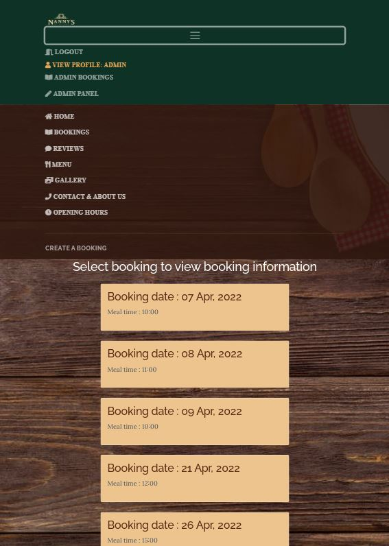
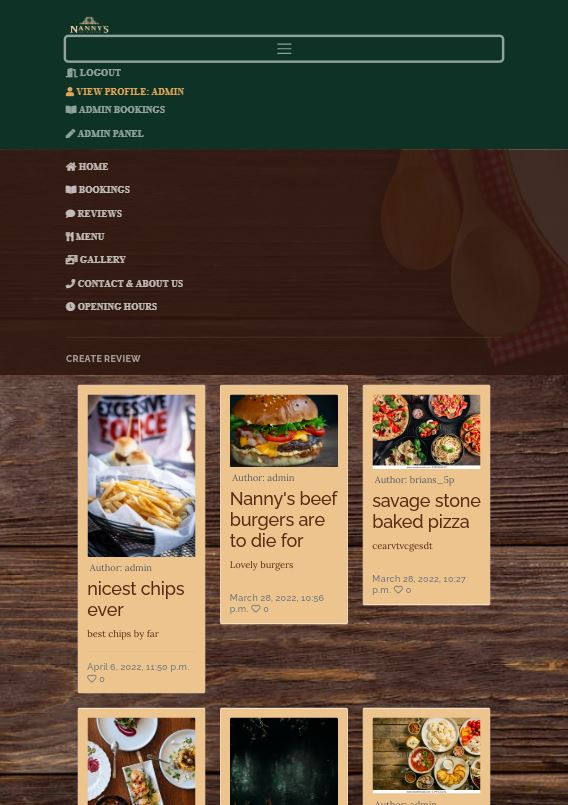
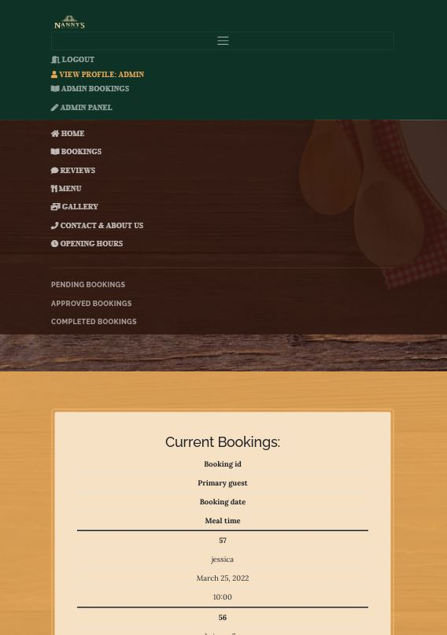

# FINE-WINE-N-DINE @ NANNY'S

FINE-WINE-N-DINE is a web application based on a local Public house and restaurant "Nanny's of Duleek" with a state of the art restaurant "Fine-wine-n-dine", sports bar, cocktail bar and accomodation to come in the near future.

The purpose of this web application is to showcase the Public house "Nanny's of Duleek" and restaurant "Fine-wine-n-dine" and allow users to create and manage their bookings for the restaurant, which can hold a maximum of 60 guests in one sitting, and to allow bookings of up to 60 guests per hour during the opening hours. 

Users can also create, read, comment and like reviews from past guests or leave a review voicing their opinions of the restaurant and public house. 

The benefit of this application will allow users to create and manage bookings online and their bookings will be catered for on their chosen date and time. Users can create accounts and update edit and delete their accounts should they feel the need to do so.

[Deployed site](https://b-stritch-p4-fine-wine-n-dine.herokuapp.com/)

## Table of Contents
1. [**UX**](#ux)
    1. [**User Stories**](#user-stories)
        1. [**New Users**](#new-users)
        2. [**Existing Members**](#existing-members)
        3. [**Admin / Staff Users**](#admin-/-staff-users)
    2. [**Wireframes**](#wireframes)
    3. [**Entity Relationship Diagram (ERD)**](#entity-relationship-diagram-(ERD))
2. [**Features**](#features)
    1. [**Existing Features**](#existing-features)
        1. [**Regular Users**](#regular-users)
        2. [**Staff Users**](#staff-users)
    2. [**Future Features**](#future-features)
3. [**Technologies Used**](#technologies-used)
4. [**Testing**](#testing)
    1. [**User Credentials**](#user-credentials)
        1. [**Test User**](#test-user)
        2. [**Test User Staff**](#test-user-staff)
    2. [**Manual**](#manual)
    3. [**Validation**](#validation)
        1. [**CSS**](#CSS)
        2. [**HTML**](#HTML)
        3. [**JavaScript**](#javaScript)
        4. [**Accessibility**](#accessibility)
    4. [**Automated**](#automated)
        1. [**Django / Coverage**](#django-/-coverage)
            1. [**Test Steps**](#test-steps)
    5. [**Responsiveness**](#responsiveness)
    6. [**Bugs Found**](#bugs-found)
5. [**Deployment**](#deployment)
    1. [**GitHub**](#GitHub)
        1. [**To commit the code on GitPod to GitHub**](#to-commit-the-code-on-GitPod-to-GitHub)
    2. [**Heroku**](#heroku)
6. [**Credits**](#credits)
    1. [**Content**](#content)
    2. [**Media**](#media)
    3. [**Acknowledgements**](#acknowledgements)

## UX
This project was designed to allow users to, through CRUD functionality, manage bookings for the restaurant, reviews from guests past present. In particular;
- Allows users to create an account through the signup form
- Allows users to edit their accounts details on their profile page
- Allows users to delete their accounts from their profile page

- Allows users to create a booking through the create booking form attached to the bookings page
- Allows users to edit their booking through the edit booking form attached to the bookings page
- Allows users to delete their booking through the delete booking link attached to the edit bookings page

- Allows users to create a review through the create review form attached to the reviews page
- Allows users to edit their review through the edit review form attached to the reviews page
- Allows users to delete their review through the delete review link attached to the edit reviews page

- Allows users to create a comment through the create comment form attached to the reviews page
- Allows users to edit their comment through the edit comment form attached to the reviews page
- Allows users to delete their comment through the edit comment link attached to the edit reviews page

This website is designed for the regular everyday individuals and is appropriate to all age groups as the restaurant caters for all age groups and with the additional sports bar attached which would be particularly aimed at sports fans as the venue has 12 large screens based in seperate areas in the establishment and offers a diverse selection of sporting events daily. The website allows guests to create reviews and tells others of their experiences. 

At nanny's, there are four types of vintage wines on draught along with all the regular slection of beers, however, nanny's has been fitted with a cocktail bar for the guests who like an exotic beverage which makes for some fantastic images for reviews.

I feel that this website satisfies the base requirements in that the users can create, read, update and delete data related to items in the database in an easy to use and visually appealing interface. 

There are a range of apps including Bookings, Reviews and Site pages that all work together seamlessly to provide a beautifully designed and easy to navigate website that has been designed to appeal to a wide range of users. 

A new user who does not have an account will only have access to the homepage (index.html), the about us page, the menu page, contact and about us page,a restricted version of the reviews page the signup page, and the login page. They will be unable to make bookings, leave reviews or comments on the existing reviews.  

Once logged in, the members will have access to the sites remaining functionality for creating reviews, commenting and liking reviews, creating bookings, viewing existing bookings, editing and deleting reviews,comments and editing content on their personal profile. The bookings displayed to each user are relative to the users username and the application only displays bookings created by that user.
 
###### User home page view

Once logged in, staff members have access to the same functionality as members for testing purposes.The staff status allows selected users to access the management area where staff can view all bookings , pending bookings, approved bookings, completed bookings and allows access to the django administration area where the staff member can view all bookings, reviews, comments, users etc and has administration priveledges which allows them to create edit and update reviews, comments, bookings, users etc. The administration area is required in order to publish comments which have been submitted for approval prior to the comment getting published.
###### Administration bookings view

###### Administration pending bookings view

###### Administration approved bookings view

###### Administration completed bookings view

### User Stories
#### New Users
- As a new user, I would like to be able to view information about the establishment so that I can decide whether to use their services or not
- As a new user, I would like to be able to see reasons why I should create an account so that I can decide if I would like to become a members
- As a new user, I would like to be able to view a menu to see what type of foods are on offer
- As a new user, I would like to be able to view reviews from past guests so that I can see what other users think of the establishment

#### Existing Members
- As an existing member, I would like to be able to log into my profile easily so that I avail of members only attributes of the website.
- As an existing member, I would like to be able to log into my profile easily so that I can review my profile information
- As an existing member, I would like to be able to edit my personal information on my profile so that I can keep the information up to date on the database
- As an existing member, I would like to be able to delete my profile should i wish to do so

- As an existing member, I would like to be able to view my bookings 
- As an existing member, I would like to be able to edit all of my bookings
- As an existing member, I would like to be able to delete my bookings

- As an existing member, I would like to be able to view all reviews 
- As an existing member, I would like to be able to edit all of my reviews
- As an existing member, I would like to be able to delete my reviews

- As an existing member, I would like to be able to view my comments on reviews 
- As an existing member, I would like to be able to edit all of my comments on reviews
- As an existing member, I would like to be able to delete my comments on reviews

#### Admin / Staff Users
- As a staff member, I would like to be able to view all the restaurant bookings 
- As a staff member, I would like to be able to view all the pending restaurant bookings 
- As a staff member, I would like to be able to view all the approved restaurant bookings 
- As a staff member, I would like to be able to view all the completed restaurant bookings 
- As a staff member, I would like to be able to manage all the restaurant bookings
- As a staff member, I would like for the application to stop any booking duplications
- As a staff member, I would like for the application to only allow a predefined number of guests per hour

- As a staff member, I would like to be able to view all the reviews
- As a staff member, I would like to be able to edit any of the reviews if required
- As a staff member, I would like to be able to delete a review in the event that it contains any offensive or inappropriate content
- As a staff member, I would like to be able to view all comments on reviews
- As a staff member, I would like to be able to approve or disprove all comments on reviews in the event that they contain any offensive or inappropriate content
- As a staff member, I would like to be able to edit any of the comments on a review if required 

- As a staff member, I would like to be able to view all of the users of the website so that I can manage them
- As a staff member, I would like to be able to edit a users Information should it be required
- As a staff member, I would like to be able to delete a user from the website if required
- As a staff member, I would like to be able to be able to edit a users information if required
- As a staff member, I would like to be able to be able to grant a user staff access or remove if required

### Wireframes
As there are many pages to this project, I have included the wireframes in a separate document.

Please see the wireframes.md file for the entire collection of wireframes: https://github.com/BrianStritch/Brian-Stritch-P4-Fine-Wine-n-Dine/blob/main/wireframes.md

### Site Map

### Entity Relationship Diagram (ERD)

### Entity Relationship Diagram (ERD) Map

## Features
### Existing Features
#### Regular Users 
1. Login - The customers are able to create their own accounts and log into the website with secure details.
2. Sign-Up - New users can sign up to create an account.
3. When creating a profile, it will not allow users to create a profile with the same username as another member
4. User Profile - Each user has their own profile that welcomes them by Username for personalisation.
5. Users can create bookings from the bookings page which is visible to logged in users.
6. Users can view their bookings from the bookings page which is visible to logged in users.
7. Users can select a booking and view , edit or delete the booking from the bookings detail page which is visible to logged in users.
8. Users can view reviews from past guests from the reviews page which is visible to all users.
9. Users can view specific reviews details and comments by clicking the review which redirects to the reviews detail page.
10. Users can edit or delete their own reviews or comments from the reviews detail page where an edit and delete button are visible to logged in users, but only for reviews or comments which were created by that user.
11. Users can view the menu to see what food products are available.
12. Users can view the contact and about us page to understand who the owners of the establishment are and what they are about. 
13. Users can also see the contact information, should they wish to contact the establisment directly.
14. Users can view the opnening hours to see when the establishment is open for business.
15. Users can see a gallery of images populated by images provided by guests from reviews.
16. Users can log out at any time from the site by clicking on the logout button 

#### Staff Users
1. Edit Bookings - Staff users can edit any bookings saved to the database using a simple form.
2. Edit Reviews - Staff users can edit any reviews saved to the database using a simple form.
3. Edit Comments- Staff users can edit any comments saved to the database using a simple form.
4. Delete Bookings - Staff users can delete any bookings saved to the database.
5. Delete Reviews - Staff users can delete any reviews saved to the database.
6. Delete Comments- Staff users can delete any comments saved to the database.
7. Edit Users - Staff users can edit any users saved to the database.
8. Delete Users - Staff users can delete any users saved to the database.

### Future Features
1. An Accomodation booking application will be added in a future update so the guests can stay in our new state of the art rooms.
2. A Menu app will be added in order for the staff / admin users to change the menu with a simple update form.
3. A payment method would be added in a future update so that the user can pre-pay their booking
4. A Merchandise shop will be added so that guests can purchase Nanny's clothing merchandise

## Technologies Used
- HTML - This site uses HTML to instruct the browser how to interprit the code correctly and arrange the layout.
- CSS - This site uses CSS to aid in the style, and overall theme of the website
- Bootstrap - This site uses Bootstrap elements to help design the framework of the site
- Django - This was the chosen framework for developing the project
- Python - This language was chosen to code the a large amount of the functionality of the site
- JavaScript - this was used to program some of the features on the site, such as the messages timeout
- Balsamiq - This was used to create the wireframes in the design phase
- Heroku - This was chosen to host the website app for deployment.
- Coverage - This reporting tool was installed and used to produce reports showing how much of the apps had been tested
- Cloudinary - Cloudinary storage was set up and used for storing website images
- Postgres - This Relational Datatabase was used to handle the data storage

## Testing
### User Credentials
There are two main uses on this site; a site member and a site staff member. Please use the logins below to access and review both user types:

#### Test User
- Username: testuser
- Password: administration

#### Admin User
- Username: admin
- Password: administration

### Manual
As there are many pages for the fine-wine-n-dine website which had to be manually tested to ensure functionality and UX were correct, they have been included in a separate file to avoid taking up too much space on the README.md documentation.

Please see the manual_testing.md file for the full breakdown of the manual testing done for this site. You can use this link to reach the file: https://github.com/BrianStritch/Brian-Stritch-P4-Fine-Wine-n-Dine/blob/main/manual-testing.md

During this process, several issues were discovered which have been since fixed on the site. Some examples of these include;

- The standard UserChangeForm in django did not provide the fields for updating the users first_name and last_name and a custom form was required which inherited from the UserChangeForm but was getting a 404 error on submitting. The fix for this error was add a reverse url in the form model to execute when the form was completed and submitted.

- On creating the booking form, an error was found where the primary_guest id was found to be null and must be an instance of User as the booking model primary_guest field was a foreign key of the User model and the fix for this error was to declare the form.instance.primary_guest = request.user which rectified this issue.

- The edit booking view rendered a form however this raised an error where the primary guest was null and this data could not be obtained from the POST request as it was not part of the data sent by the POST request and was not an inherited value. To rectify this error a primary key value of the user had to be passed with the url in the edit button on the bookings detail page, which in turn passed the value to the edit booking page which was then passed with the POST request and the form was then validated and saved. This same issue was found for the delete booking view, edit review, delete review, edit comment, delete comment, edit user profile and delete user profile where a value was needed to be sent with the url in the button

- When the application was deployed on heroku a 500 internal server error was noted on some of the pages when selected and it was found that  was not at the top of all documents as i thought it was only required in the base.html file. By placing the  statement on the top of all the required pages this rectified this error.

- When the project was deployed to heroku it was found that if the user registration form, create booking form, edit booking form, create review form, edit review form, create comment form, edit comment forms contained any invalid data that the a 500 internal server error was raised and the application would halt. After revising the vews.py files for the respected form views it was found that an if statement was checking the validity of the form data if the data was valid would then save the data to the database. There was no else statement attached and this meant that the application could not process the data and there was no alternative path. To rectify this issue i added an else statement which redirected the user to the required page where the user could resubmit the data.

- The application is set up to allow a maximum of 60 guests in one hour, and each booking can accomodate up to 10 guests at a table and when a booking is created, the POST request data is checked against two database queries to detemine if the booking can be validated. The first check against the database is to check if the user who is making the booking has already chosen the time and dates submitted and if so will return the user to the booking form page with a message notifying them that they have already created a booking for this date and time and to choose an alternative time or date. The second check against the database checks how many bookings have been created for this specific time and date and if there is an available space will save the booking, and if no space is available, will return the user to the booking form page with a message notifying them that they have already created a booking for this date and time and to choose an alternative time or date. On creating this logic it was found that the standard django updateview allowed the bookings to be edited and did not apply the logic as per the booking creation form. The fix for this issue was to create a custom view with GET and POST requests and apply the same logic to the POST request as the booking creation form to check the validity of the updated data prior to saving to the database.

- During manual testing it was noted that the color schemes were displayed differently between browsers. The tests were carried out on chrome mobile browser and samsung internet browser where differences were noted. please see below images displaying same:

###### Google Chrome mobile browser

###### Samsung mobile browser

There are other issues that could not be fixed due to ability / time contraints that have been included in the "Bugs Found" section below. 

### Validation

#### CSS
The custom.css file code was validated using the The W3C CSS Validation Service and the image below verifies that the code was successfully validated with no errors. Numerous warnings were noted which relate to the bootstrap CSS files inherited with the template, however none of the custom css written for this web application failed or had any warnings present.

    

     

    

       

#### HTML

All HTML pages have been checked using the W3C Markup Validation Service. Some Errors were found in the Edit_profile.html page which relate to the fields automaticaly rendered using crispy forms.

Some of the page urls were raising a 500 error when the validator attempted to test the page, however to avoid this, the page source code was used for testing, however the tool pointed to several small issues on some pages that were of no consequence, such as opening p tags not being found for a closing /p tag, when they were present in the code, however these issues only related to the crispy forms mentioned above.

Please see the w3c-validation.md file for the full breakdown of the HTML W3C validation testing done for this site. You can use this link to reach the file: https://github.com/BrianStritch/Brian-Stritch-P4-Fine-Wine-n-Dine/blob/main/w3c-validation.md

#### JavaScript
JS Hint was used to ensure that the JavaScript used in the website had no errors.

### Accessibility
All HTML pages have been tested for accessibility and performance using Chrome Devtools Lighthouse testing platform and the results of which can be found by clicking the following link to reach the file: https://github.com/BrianStritch/Brian-Stritch-P4-Fine-Wine-n-Dine/blob/main/accessibility-tests.md

### Automated
#### Django / Coverage
Django tests were written and Coverage was used to product detailed reports to ensure the sites apps were tested as much as possible. On testing the applicatin with coverage it was noted that an overall score of 86% was obtained. After adding Docstrings to the files this figure was reduced significantly to 50%. The results for each of the coverge tests can be seen below.

1. In the terminal, use: "coverage report"
    - generates a detailed report showing what has/what needs testing

2. In order to product a html report which allows you to inspect in each file, to see in easy to use colour codes the lines of code which have been tested or which have not yet been tested, please use the following command: "coverage html"

##### __Coverage report prior to adding docstrings__

##### __Coverage report after adding docstrings__

The overall coverage rate for the entire sites apps is currently at 50%. At a later date, more testing will be needed to increase the coverage rate to 100% to ensure that the website is functioning correctly. However, between the Django tests and the manual testing done, the website does not show any errors or major bugs, other than those listed in the "Bugs Found" section below.

It was also noted at the time of compiling this readme that after running the coverage report and obtaining a 50% Total result, after switching the database for running unittest tests, the coverage report now has a result of 10%, however the report is now testing the migration files which it was not previously. I was getting a 50% total when running the tests prior to this and i think there may be an error in the testing of the application, however i would not posess the technical knowledge or ability to confirm this. 

##### Unittest
In order to run tests on GitPod using unittest (which has been installed to handle testing), please follow the below steps in the terminal on GitPod:

1. In fine-wine-n-dine settings.py the database needs to be switched to the local database as the tests will not run when on the heroku postgres database. The loal database is kept in commented out form to allow switching of the database for testing purposes.

2. Run the following code : "pyhton3 manage.py test"
    - This will run a test on all test.py files in the app and will display in the terminal if all tests are passing, and if it does not it will show the error causing the test to fail.

### Responsiveness
This website has been designed to scale correctly to different screen sizes with no issues on layout. In order to ensure that the view was pleasant to the user, certain divs and items had to be arranged differently or hidden/shown depending on screen size. This was handled using CSS media queries.

##### Full Size Menu

##### Small Screen Menu

##### Small Screen Menu Additional nav for Bookings

##### Small Screen Menu Additional nav for Reviews

##### Small Screen Menu Additional nav for Admin

In order to ensure that the navigation bar was as responsive as possible, on Desktop the menu shows accross the top of the page while on mobile screens, the menu reduced to a burger icon wide visible button. When the burger icon is clicked, the menu appears as a dropdown with the links to other pages from the nav bar. 

On the bookings page there is an additional nav bar which contains the link to create a booking which drops down with the navigation menu only on the bookings page. 

On the reviews page there is an additional nav bar which contains the link to create a review which drops down with the navigation menu only on the reviews page. 

On the admin bookings page there is an additional nav bar which contains the links to pending bookings, approved bookings, completed bookings and all bookings which drops down with the navigation menu only on the admin bookings page. 

Each page was altered slightly between mobile and desktop for its layout to ensure that the user is getting the best UX possible, regardless of the screen size they are using. This can be seen in the wireframes section as I have included a wireframe of each page with desktop and mobile view. 

### Bugs Found
- When the application was deployed on heroku a 500 internal server error was noted on some of the pages when selected and it was found that  was not at the top of all documents as i thought it was only required in the base.html file. By placing the  statement on the top of all the required pages this rectified this error.

- During the manual testing it was found that the user did not know that by clicking the username that it would redirect to the user profile details page. This issue was rectified by renaming the link.

- When the project was deployed to heroku it was found during manual testing that if the user registration form, create booking form, edit booking form, create review form, edit review form, create comment form, edit comment forms contained any invalid data that the a 500 internal server error was raised and the application would halt. After revising the vews.py files for the respected form views it was found that an if statement was checking the validity of the form data if the data was valid would then save the data to the database. There was no else statement attached and this meant that the application could not process the data and there was no alternative path. To rectify this issue i added an else statement which redirected the user to the required page where the user could resubmit the data.

- It was found during manual testing that some of the page urls were raising a 500 error when the user attempted to test the page, this was rectified by including the  tag on all required pages.

- During manual testing it was found that the user did not know that by clicking the booking in the bookings view that it would redirect the user to the booking details page where the user could then edit or delete the booking.The booking card in the bookings page was displaying too much information and the user was able to view all the booking details without selecting the booking and being redirected to the booking details page. To fix this error the information displayed was significantly reduced and a message was displayed to the user to "click on a booking to view booking details".

- During manual testing numerous issues with styling and layouts were noted which required modifications to the bootsrap classes to display the content as required in this application.

- During manual testing it was noted that the color schemes were displayed differently between browsers. The tests were carried out on chrome mobile browser and samsung internet browser where differences were noted. please see below images displaying same:

###### Google Chrome mobile browser

###### Samsung mobile browser

## Deployment
This project was deployed to Heroku at the address https://b-stritch-p4-fine-wine-n-dine.herokuapp.com/ using the following steps

### GitHub:
- Create a new project on GitHub
- Click the green Gitpod button to open in Gitpod

#### To commit the code on GitPod to GitHub:
- In the terminal, type "git add ." to add all new changes to the code to staging area
- Next, type "git status" to see which files are ready to be commited
- Commit these by typing "git commit -m" and adding a detailed description of the commit in ""
- Next, push the code commit to GitHub by typing "git push"

### Heroku:
- Create a Heroku account
- Create a new app
- Link the Heroku app with your GitHub repository
- Push changes to git using the terminal and verify that the connection to Heroku is working
- Add environment variables to Heroku settings.
- In Heroku click the deploy tab, click on deploy to deploy the latest branch of your repository
    - You can click on automatic deployment where each new push to github will be deployed to heroku

## Credits
### Content
- Font icons imported from FontAwesome. 
### Media
As there are many images for the reviews in this website, most of which were obtained from Pexels.com, shutterstock.com and some images obtained from the establishment facebook page.

### Acknowledgements
- I would like to acknowledge my mentor Mo Shami for all of his help and advice with this project
- I would like to thank my friends and family for their testing help and advice with this project
- I would like to thanks the establishment management of Nannys for permission to use the images from their facebook site.
