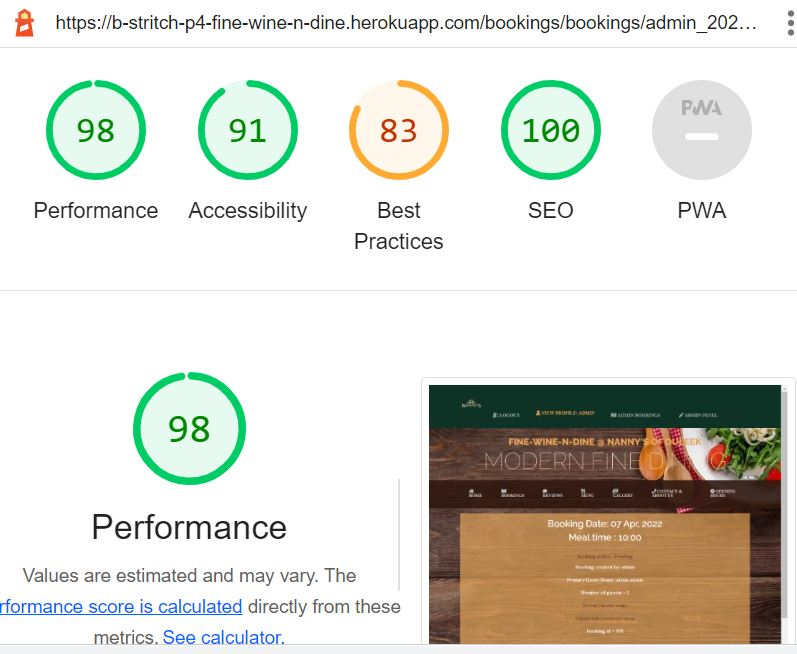

# Accesibility Testing with Lighthouse

## Site_pages App
### Home Page

### User Profile Page

### Edit Profile Page

### Delete User Page

### Menu Page

### Opening Times

### Contact and About-us

## Bookings App
### Bookings Page

### Create Booking Page

### Booking Details Page

### Edit Booking Page

### Delete Booking Page

### Admin Bookings Page

### Admin Pending Bookings Page

### Admin Approved Bookings Page

### Admin Completed Bookings Page

## Review App 
### All Reviews

### Create Review

### Review Details and Create and read Comments

### Edit Reviews

### Delete Reviews

### Edit Comment

### Delete Comment

