# Python Testing With Pep-8

## Site_pages App
### site_pages/apps.py
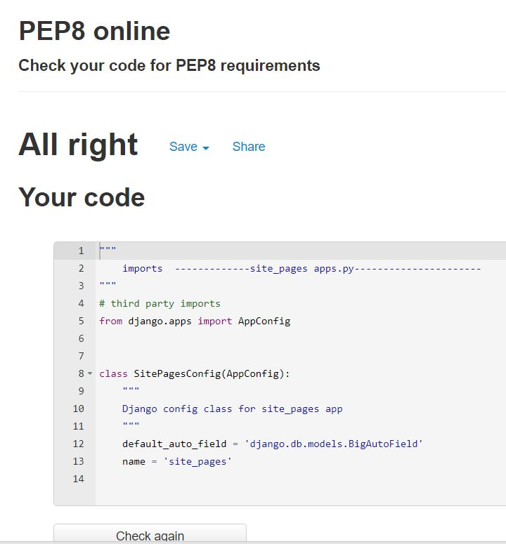

### site_pages/forms.py
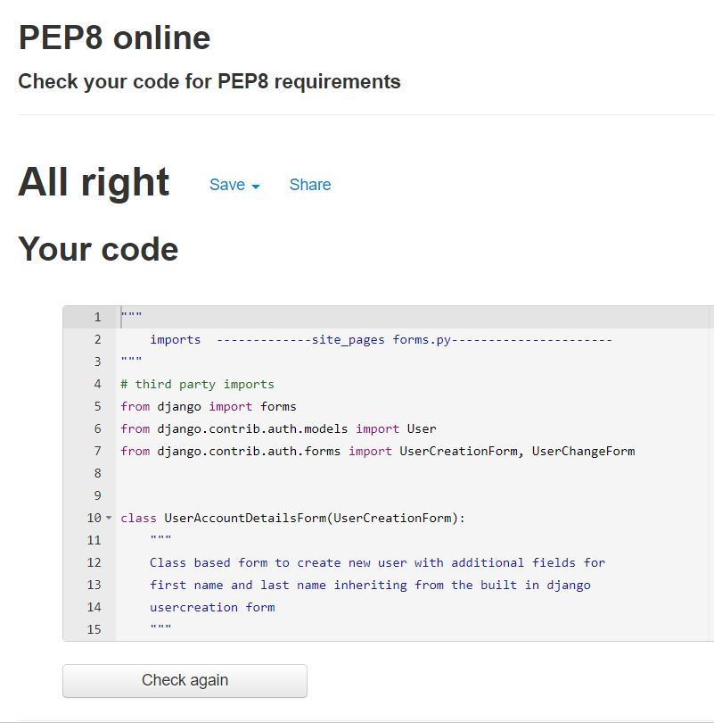

### site_pages/urls.py
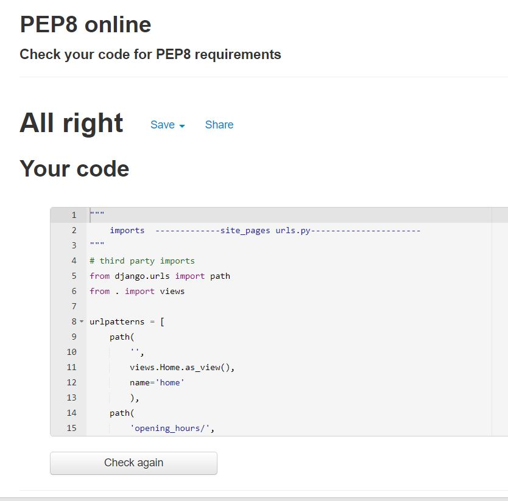

### site_pages/views.py
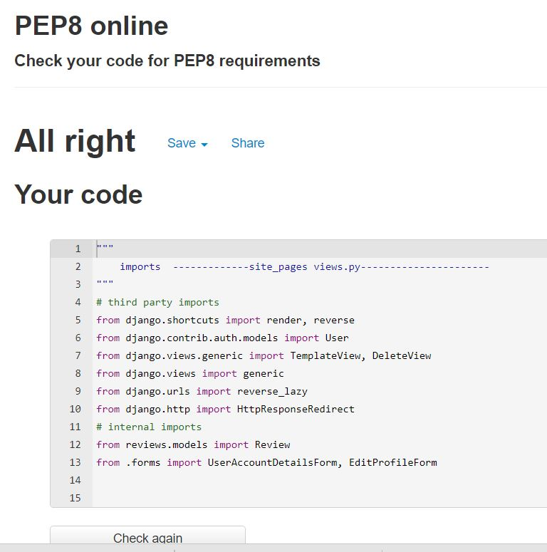

## Bookings App
### bookings/apps.py
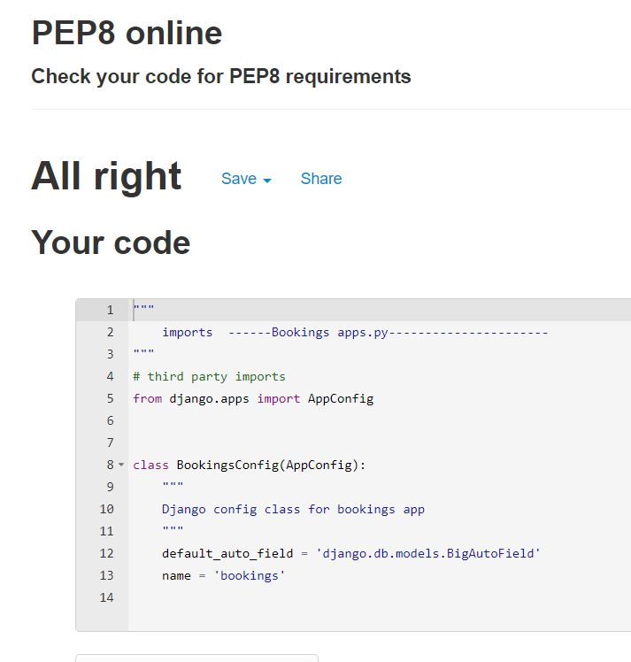

### bookings/forms.py
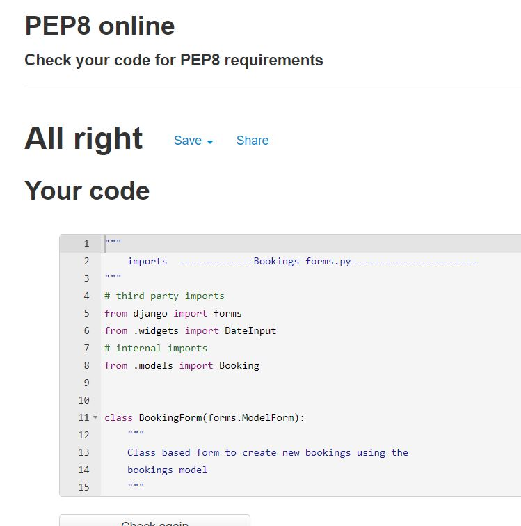

### bookings/urls.py
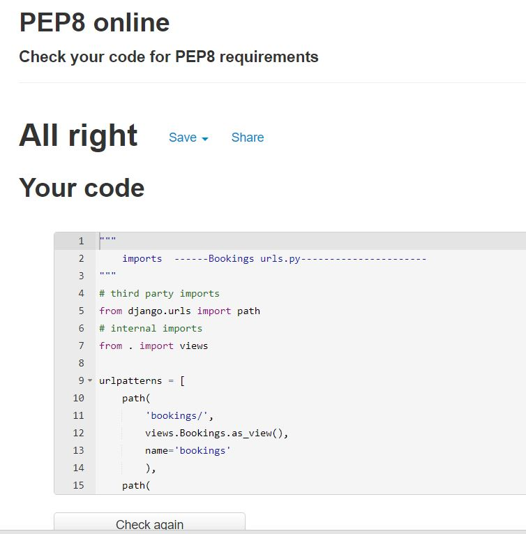

### bookings/views.py
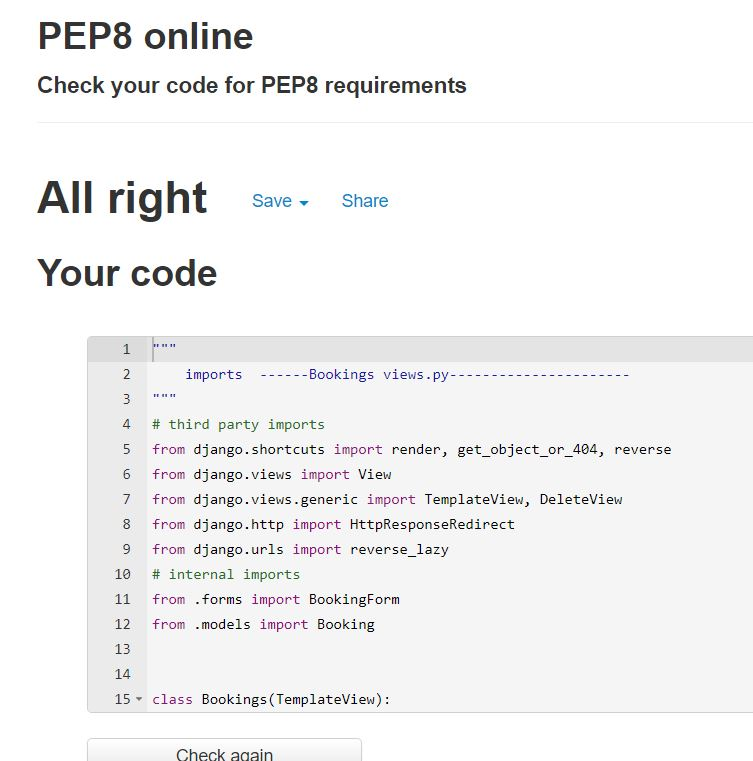

### bookings/admin.py
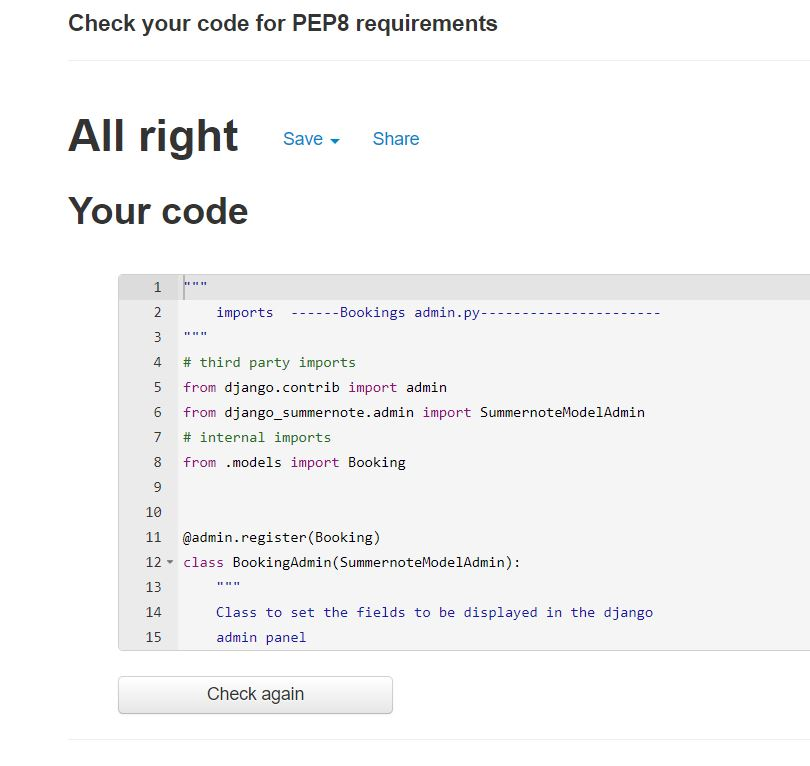

### bookings/models.py
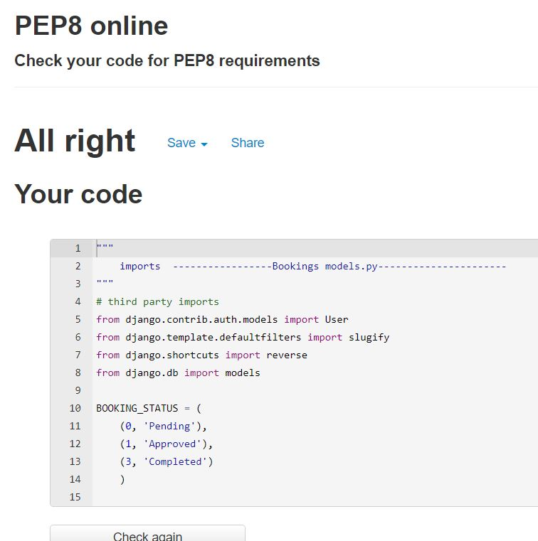

### bookings/widgets.py
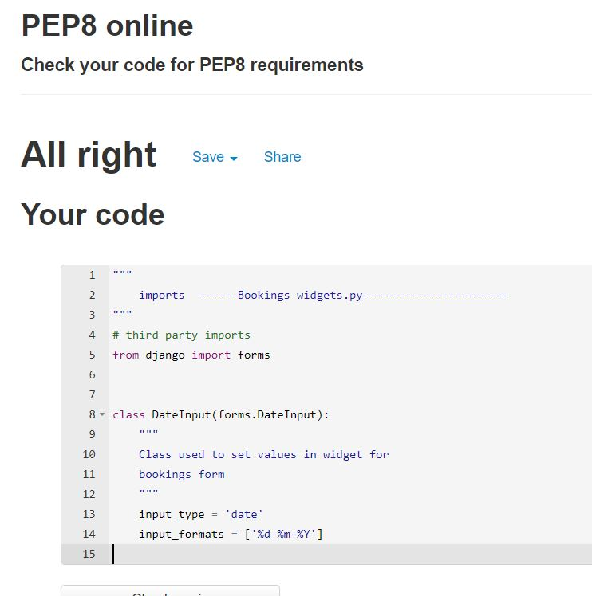

## Reviews App 
### Reviewsapps.py
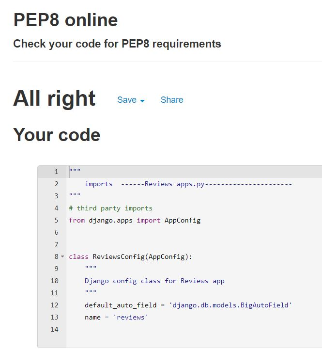

### Reviews/forms.py
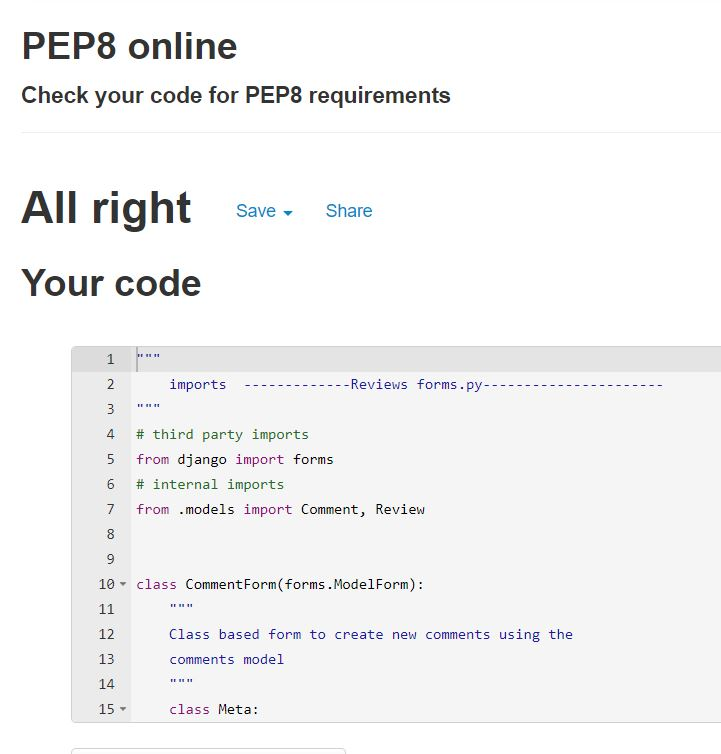

### Reviews/urls.py
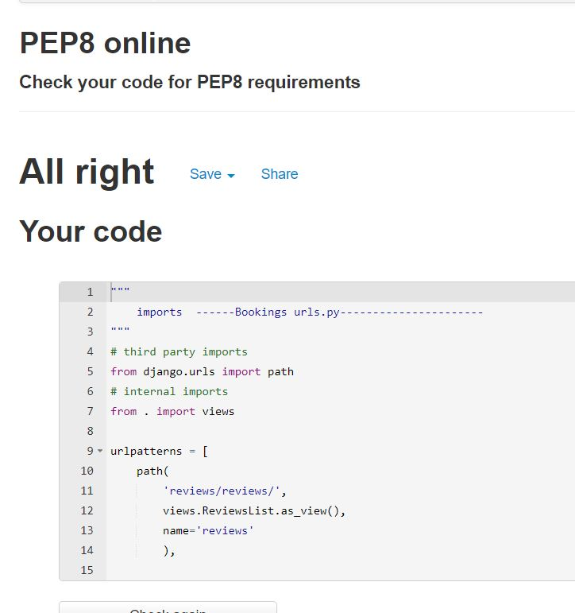

### Reviews/views.py
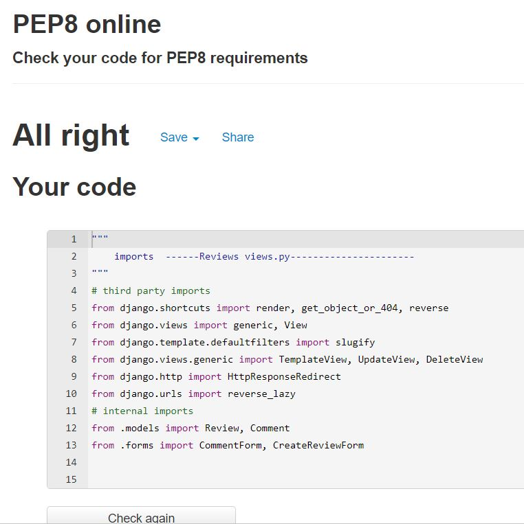

### Reviews/admin.py
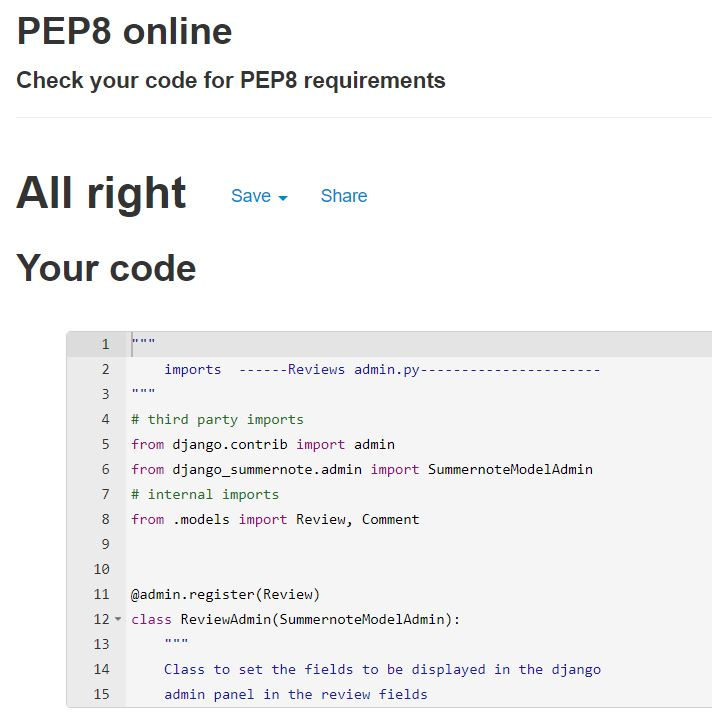

### Reviews/models.py
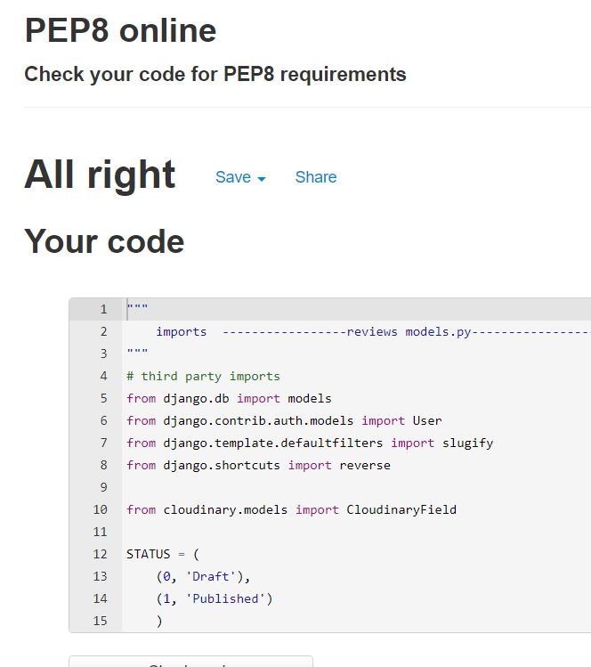

